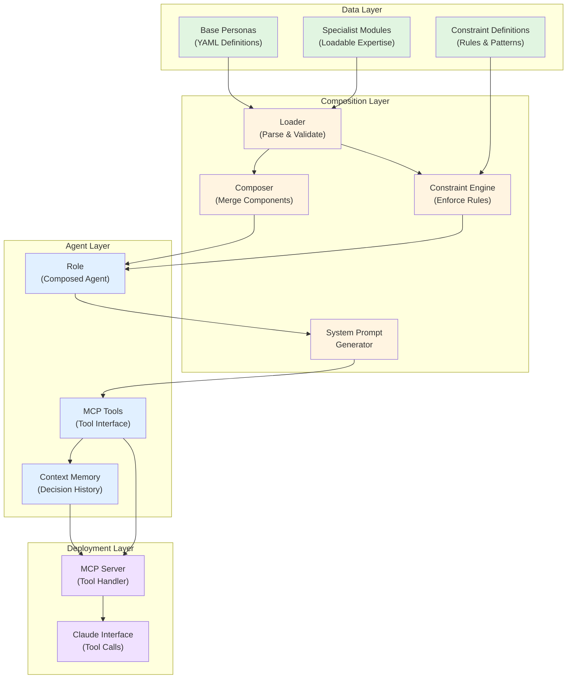
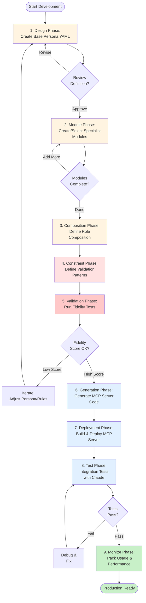
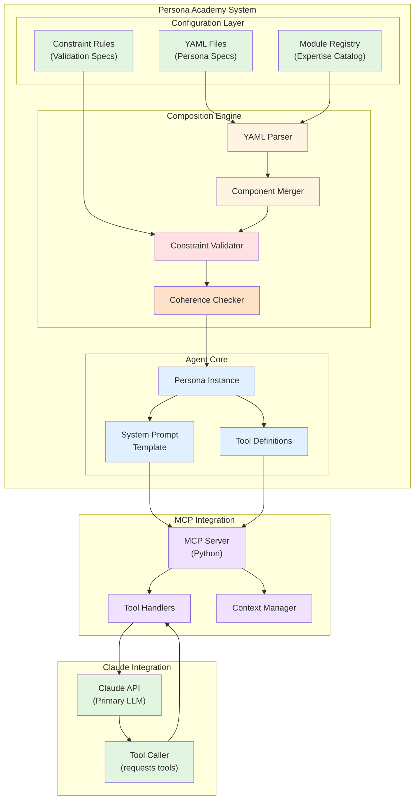
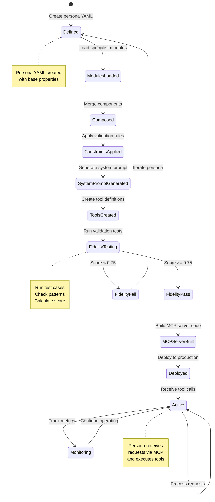
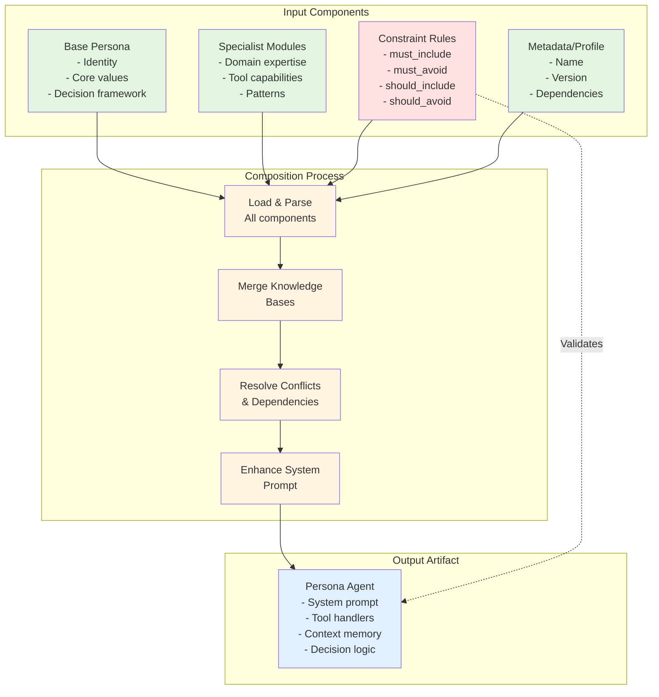

# Persona Academy - System Diagrams

## 1. System Architecture Diagram



---

## 2. Composition Flow Diagram

```mermaid
graph LR
    START([User Creates Role]) --> LOAD_YAML["Load Base Persona<br/>YAML"]

    LOAD_YAML --> VALIDATE_YAML{YAML<br/>Valid?}
    VALIDATE_YAML -->|No| ERROR1["Error:<br/>Invalid Format"]
    VALIDATE_YAML -->|Yes| LOAD_MODULES["Load Specialist<br/>Modules"]

    LOAD_MODULES --> VALIDATE_MODULES{Modules<br/>Found?}
    VALIDATE_MODULES -->|No| ERROR2["Error:<br/>Module Not Found"]
    VALIDATE_MODULES -->|Yes| MERGE["Merge Base +<br/>Specialist Knowledge"]

    MERGE --> APPLY_CONSTRAINTS["Apply Constraint<br/>Engine Rules"]

    APPLY_CONSTRAINTS --> CHECK_CONFLICTS{Constraint<br/>Conflicts?}
    CHECK_CONFLICTS -->|Yes| ERROR3["Error:<br/>Conflicting Rules"]
    CHECK_CONFLICTS -->|No| GENERATE_PROMPT["Generate System<br/>Prompt"]

    GENERATE_PROMPT --> CREATE_TOOLS["Create MCP<br/>Tool Signatures"]

    CREATE_TOOLS --> VALIDATE_COHERENCE{Coherence<br/>Check}
    VALIDATE_COHERENCE -->|Low| WARN["Warning:<br/>Low Coherence"]
    VALIDATE_COHERENCE -->|High| BUILD_AGENT

    WARN --> BUILD_AGENT["Build Agent<br/>Instance"]
    BUILD_AGENT --> READY["Ready:<br/>Persona Agent"]

    ERROR1 --> END([Error State])
    ERROR2 --> END
    ERROR3 --> END
    READY --> END([Success])

    style LOAD_YAML fill:#fff4e1
    style LOAD_MODULES fill:#fff4e1
    style MERGE fill:#fff4e1
    style APPLY_CONSTRAINTS fill:#ffe1e1
    style GENERATE_PROMPT fill:#fff4e1
    style CREATE_TOOLS fill:#fff4e1
    style BUILD_AGENT fill:#e1f0ff
    style READY fill:#c8f0c8
    style ERROR1 fill:#ffc8c8
    style ERROR2 fill:#ffc8c8
    style ERROR3 fill:#ffc8c8
    style WARN fill:#ffe1c8
```



---

## 3. Boardroom Orchestration Pattern

```mermaid
sequenceDiagram
    participant User
    participant Claude as Claude<br/>Orchestrator
    participant Selector as Role Selector
    participant P1 as Persona A<br/>(Expert Tool)
    participant P2 as Persona B<br/>(Expert Tool)
    participant P3 as Persona C<br/>(Expert Tool)
    participant Synthesizer as Response<br/>Synthesizer

    User->>Claude: Ask strategic question
    Claude->>Selector: Which personas needed?
    Selector-->>Claude: Personas A, B, C ranked

    par Parallel Persona Calls
        Claude->>P1: Call Persona A tool<br/>(with context)
        Claude->>P2: Call Persona B tool<br/>(with context)
        Claude->>P3: Call Persona C tool<br/>(with context)
    end

    P1-->>Claude: Perspective A + reasoning
    P2-->>Claude: Perspective B + reasoning
    P3-->>Claude: Perspective C + reasoning

    Claude->>Synthesizer: Merge perspectives
    Synthesizer-->>Claude: Integrated response<br/>with citations
    Claude->>User: Strategic answer<br/>with multi-persona<br/>reasoning

    style Claude fill:#e1f0ff
    style P1 fill:#e1f5e1
    style P2 fill:#e1f5e1
    style P3 fill:#e1f5e1
    style Selector fill:#fff4e1
    style Synthesizer fill:#f0e1ff
```

---

## 4. Factory Pipeline Diagram



---

## 5. Fidelity Validation Flow

```mermaid
graph LR
    START([Validation Cycle]) --> SELECT["Select Test Case:<br/>Decision + Context"]

    SELECT --> PROMPT_BUILD["Build System<br/>Prompt<br/>(with persona definition)"]

    PROMPT_BUILD --> CALL_CLAUDE["Call Claude API<br/>with Persona +<br/>Test Input"]

    CALL_CLAUDE --> RESPONSE["Get Response<br/>from Claude"]

    RESPONSE --> PARSE["Parse & Extract<br/>Key Patterns"]

    PARSE --> CHECK_POSITIVE["Check Positive<br/>Patterns"]

    CHECK_POSITIVE --> MUST_INCLUDE["must_include<br/>patterns present?"]
    MUST_INCLUDE -->|No| FAIL1["FAIL:<br/>Missing required<br/>content"]
    MUST_INCLUDE -->|Yes| SHOULD_INCLUDE

    SHOULD_INCLUDE["should_include<br/>patterns present?"]
    SHOULD_INCLUDE -->|No| SCORE1["Score: 0.7<br/>(partial match)"]
    SHOULD_INCLUDE -->|Yes| SCORE2["Score: 0.9<br/>(good match)"]

    SCORE1 --> CHECK_NEGATIVE
    SCORE2 --> CHECK_NEGATIVE

    CHECK_NEGATIVE["Check Negative<br/>Patterns"]

    CHECK_NEGATIVE --> MUST_AVOID["must_avoid<br/>patterns present?"]
    MUST_AVOID -->|Yes| FAIL2["FAIL:<br/>Contains prohibited<br/>content"]
    MUST_AVOID -->|No| SHOULD_AVOID

    SHOULD_AVOID["should_avoid<br/>patterns present?"]
    SHOULD_AVOID -->|Yes| PENALTY["Reduce score<br/>by 0.2"]
    SHOULD_AVOID -->|No| FINAL_SCORE

    PENALTY --> FINAL_SCORE
    SCORE1 --> FINAL_SCORE
    SCORE2 --> FINAL_SCORE

    FINAL_SCORE["Calculate Final<br/>Fidelity Score"]

    FINAL_SCORE --> THRESHOLD{Score >= 0.75?}

    THRESHOLD -->|No| FAIL3["FAIL:<br/>Low Fidelity"]
    THRESHOLD -->|Yes| PASS["PASS:<br/>Fidelity Validated"]

    FAIL1 --> END([Validation Result])
    FAIL2 --> END
    FAIL3 --> END
    PASS --> END

    style SELECT fill:#fff4e1
    style PROMPT_BUILD fill:#fff4e1
    style CALL_CLAUDE fill:#e1f0ff
    style RESPONSE fill:#e1f0ff
    style PARSE fill:#fff4e1
    style CHECK_POSITIVE fill:#c8e1ff
    style MUST_INCLUDE fill:#c8e1ff
    style SHOULD_INCLUDE fill:#c8e1ff
    style SCORE1 fill:#ffe1c8
    style SCORE2 fill:#e1f5e1
    style CHECK_NEGATIVE fill:#c8e1ff
    style MUST_AVOID fill:#c8e1ff
    style SHOULD_AVOID fill:#c8e1ff
    style PENALTY fill:#ffe1c8
    style FINAL_SCORE fill:#fff4e1
    style PASS fill:#c8f0c8
    style FAIL1 fill:#ffc8c8
    style FAIL2 fill:#ffc8c8
    style FAIL3 fill:#ffc8c8
```



---

## 6. Component Interaction Diagram (C4-style)



---

## 7. State Machine - Persona Lifecycle



---

## 8. Composition Matrix - Persona Building Blocks



---

## Diagram Usage Guide

### Diagram 1: System Architecture
Use to explain how Persona Academy components fit together. Start here for stakeholder overview.
- Shows data flow from configuration → composition → deployment
- Color coding: Green (input), Yellow (processing), Blue (output), Purple (integration)

### Diagram 2: Composition Flow
Use to explain the step-by-step process of creating a role from scratch.
- Shows validation gates and error paths
- Warning states for suboptimal but acceptable outputs

### Diagram 3: Boardroom Orchestration
Use to illustrate multi-agent decision-making pattern.
- Sequence diagram showing parallel tool calls
- Demonstrates how Claude synthesizes multiple expert perspectives

### Diagram 4: Factory Pipeline
Use for project management and development workflow visualization.
- Shows 9 phases from design through production
- Feedback loops for iteration and refinement
- Identifies when to cycle back vs. move forward

### Diagram 5: Fidelity Validation
Use to explain the testing and validation system in detail.
- Shows decision tree for pattern matching
- Scoring thresholds and penalty system
- Clear pass/fail criteria

### Diagram 6: Component Interaction (C4)
Use for architecture deep-dive and system design reviews.
- Shows layer separation (config → composition → agent → MCP)
- Bidirectional communication with Claude

### Diagram 7: State Machine
Use to explain persona lifecycle from creation to production.
- Shows all states and transitions
- Iteration loops for failing validations

### Diagram 8: Composition Matrix
Use to explain how individual components combine into a complete persona.
- Shows input components, process steps, and output artifact
- Constraint validation as a cross-cutting concern

---

## Color Scheme Legend

| Color | Meaning |
|-------|---------|
| Green (#e1f5e1) | Input, configuration, modules |
| Yellow (#fff4e1) | Processing, composition, generation |
| Light Blue (#e1f0ff) | Core agent, execution |
| Purple (#f0e1ff) | MCP server integration |
| Light Red (#ffe1e1) | Constraints, validation rules |
| Orange (#ffe1c8) | Warnings, partial success |
| Salmon (#ffc8c8) | Errors, failures |
| Light Green (#c8f0c8) | Success, production ready |

